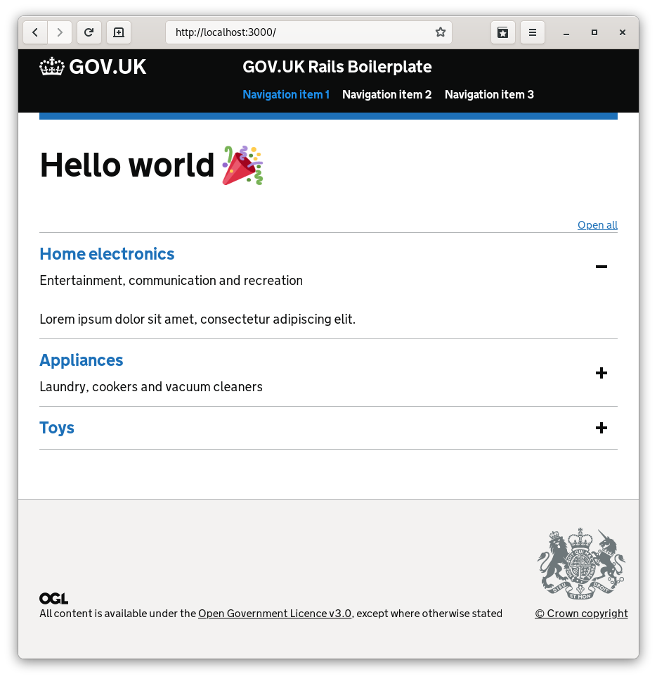

# README

This is a throwaway test intended to see how tricky it is to get Rails 7 working with GOV.UK assets.

The following things are included:

* govuk-frontend bundled by [esbuild](evanw/esbuild) and [Dart Sass](https://sass-lang.com/dart-sass)
* asset building (roughly) integrated with Foreman
* govuk-components and govuk-formbuilder
* no tests 😱

## How to test it out

1. Install Ruby 3.0.2
2. Clone this repo
3. Bundle and Yarn
3. `bin/dev`
4. Browse to `http://localhost:3000`

## Preview

